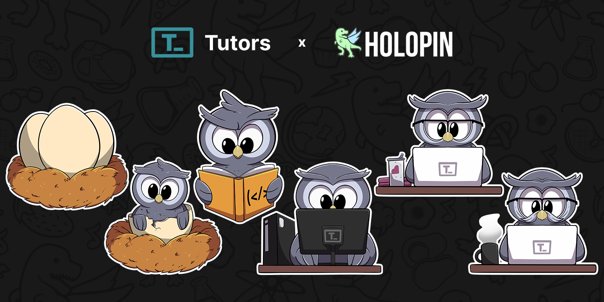

<p align="center">
  <a href="https://tutors.dev">
    
</p>

<h3 align="center">
Tutors: An Open Learning Web Toolkit
</h3>

<p align="center">
  <a href="https://tutors.dev">Website</a> |
  <a href="https://tutors.dev/course/tutors-reference-manual">Documentation</a>
</p>

# What is Tutors?

Tutors is a collection of open source components and services supporting the creation of transformative learning experiences using open web standards. It consists of two key components:

- *Generator:*  transforms a [folder of learning content](https://github.com/tutors-sdk/tutors-reference-course)  into a Tutors course

- *Reader*: presents a Tutors course as an intuitive, discoverable and attractive [Web experience](https://tutors.dev/course/reference-course)

This repo is the Tutors Reader. A companion repo:

- <https://github.com/tutors-sdk/tutors-apps>

...host the generators + support tools. These components are developed in the open by an active and friendly community, based on a [simple set of values](https://tutors.dev/course/tutors-reference-manual#tutors-values).

Some representative examples:

- [Higher Diploma in Computer Science Portal](https://tutors.dev/course/wit-hdip-comp-sci-showcase)
- [Full Stack Development](https://tutors.dev/course/full-stack-web-dev-oth-2022)
- [Reference Course](https://tutors.dev/course/reference-course)
- [Higher Diploma in Computer Science at SETU: 2020-2022](https://tutors.dev/course/wit-hdip-comp-sci-2020)
- [Classic Design Patterns](https://tutors.dev/course/classic-design-patterns)
- [Agile Software Development](https://tutors.dev/course/agile-dev-2021)
- [Technologische Fähigkeiten](https://tutors.dev/course/zusatzstudium-digital-skills-semester1)

# Getting Started

Make sure you have Node 18 + installed, and start by cloning this repo:

```bash
git clone https://github.com/tutors-sdk/tutors.git
```

Open a shell and change into the project folder and run `npm install`...

```bash
cd tutors
npm install
```

Then copy the file `.env.example` to `.env`

```bash
cp .env.example .env
```

Now to start the app you can run this command from the root:

```bash
npm run app
```

This should launch the application:

```bash
  VITE v5.0.12  ready in 1069 ms

  ➜  Local:   http://localhost:3000/
  ➜  Network: use --host to expose
  ➜  press h + enter to show help

```

Now the app is up and running and you can browse to it by opening the <a href="http://localhost:3000/">local location</a> in your browser.

The Tutors reader relies on a segment of the url to locate the course to display. Any of the samples above can be 'read' with an appropriate url segments appended to the local url you now have running. So for instance:

- <https://tutors.dev/course/reference-course>


... can be loaded locally by:

- <http://localhost:3000/course/reference-course>


(Note the port number may vary)

The 'source' for the above course is here:

- https://github.com/tutors-sdk/tutors-reference-course

You could try any of the other sample courses above. For example this course:

- https://tutors.dev/course/full-stack-web-dev-oth-2022

can be opened by this local reader like this:

- https://localhost:3000/course/full-stack-web-dev-oth-2022


# Contributing

Please ensure to read the [Code of Conduct](./CODE_OF_CONDUCT.md) before contributing to the Tutors project.

When contributing, pull requests should be opened to the 'development' branch.



All contributors are eligible to earn a [Holopin](https://holopin.io) - a digital badge that represents your contributions to the project. These badges evolve the more contributions you make to the project!

Every time you open a PR that is accepted, you will be assigned holobytes. Collect these holobytes to see your owl evolve!

# Sponsors

This project is powered by [Netlify Open Source](https://www.netlify.com/open-source/).

[](https://www.netlify.com)

# License

[](./LICENSE)

This project is licensed under the terms of the [MIT License](./LICENSE).
