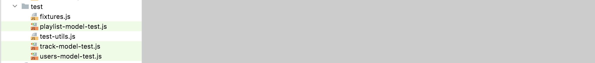

# Note Example

This is an example of a note

Restructure your tests into the following structure:

We are just moving our model tests into a subfolder. 

If you use the IDE to drag and drop these sources, we would expect the import paths to be updated by the IDE to reflect the relocation. This is the refactoring behaviour built in to most IDEs.

We are about to construct an API for our application, and we will start by scaffolding up some tests of this API in parallel with building out the API itself. These is the structure we are aiming for:

Start with this empty test:

## user-api-test.js

~~~javascript
import { playtimeService } from "./playtime-service.js";

suite("User API tests", () => {
  setup(async () => {
  });
  teardown(async () => {
  });

  test("create a user", async () => {
  });
});
~~~

# Exercises & Archives

You can link to zipped archives:

- [Solutions](./archives/archive.zip)