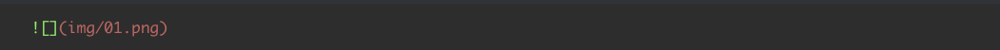
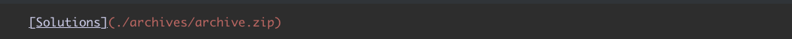

[[toc]]

## What is Tutors

Tutors is a collection of open source components and services supporting the creation of transformative learning experiences using open web standards. It consists of two key components:

- *Generator:*  transforms a [folder of learning content](https://github.com/tutors-sdk/tutors-reference-course)  into a Tutors course

- *Reader*: presents a Tutors course as an intuitive, discoverable and attractive [Web experience](https://reader.tutors.dev/course/reference-course)

These components are [developed in the open](https://github.com/tutors-sdk/tutors) by an active and friendly community, based on a clear [set of values](https://reader.tutors.dev/course/tutors-reference-manual#tutors-values).

## Getting Started

Visit [this course](https://reader.tutors.dev/course/reference-course) to become familiar with the general structure of the learning experience. [Download the source](https://github.com/tutors-sdk/tutors-reference-course/archive/refs/heads/main.zip) for the course and unzip to a local folder. Spend a few minutes exploring the content of the folder using a good editor, for example [Sublime Text](https://www.sublimetext.com/).

Install the LTS version [Node.js](https://nodejs.org/en) on your computer and create a free account on the [Netlify](https://www.netlify.com/) service.

Open a [command prompt/terminal at the course folder](https://www.groovypost.com/howto/open-command-window-terminal-window-specific-folder-windows-mac-linux/) you created above and enter the following command:

~~~bash
npx tutors-publish
~~~

This should generate a response like this (shortened here):

~~~text
Static course generator tutors-gen 2.9.15
: tutors-reference-course :  Reference Course
--: topic-01-typical :  Simple
----: unit-1 : Main Lesson
------: book-a :  Objectives
------: talk-1-intro : Lecture 1
----: unit-2 : Supporting Resources
...
--: topic-09-svg :  Iconify
----: book-a :  Objectives
----: talk-1 : Lecture 10
--: topic-10-hidden :  Hidden
~~~

A new folder called **json** will be generated by the above command. Drag & Drop this **json folder** to Netlify using this [drop target site](https://app.netlify.com/drop/) (assuming you are logged in to Netlify) . This will publish the course on the web, generating a unique url which you can verify almost immediately.  You can [customise the free domain name](https://stevemats.medium.com/how-to-rename-netlifys-default-subdomain-name-e2d493e40d6e) directly on Netlify.

If you make any changes to the course source folder, then you must proceed through the generation (_npx tutors-publish_) and publishing (drag & drop) to redeploy the course. Be sure to overwrite the existing course on Netlify, unless you want a new course. In this case, locate the deployment panel for the newly created project on Netlify and drag & drop the json folder there.

## Cards

The card metaphor is used throughout tutors as a simple visual feature to represent a variety of learning resources. In general the contents of a card are extracted from the following:

- A Markdown file, containing resource title + short summary
- An image, in png, jpg, gif or svg formats.

The title, image and summary will be presented on the card, along with a suitable icon.

The Learning resources are typically named to match the context, and are contained in a folder whose name is structured to encode the type of learning resource.

### Resource Names

Folder names convey the type of learning resource contained in the folder, with the first letters determining its type. Folders starting with the following names have a significance in Tutors:

|  Example                                                                                     | Source |
| -------------------------------------------------------------------------------------------- | ------------------------------------------  |
| [topic](https://reader.tutors.dev/topic/reference-course/topic-01-typical)                   | [Top level course topic ](https://github.com/tutors-sdk/tutors-reference-course/tree/main/topic-01-typical)|
| [unit](https://reader.tutors.dev/topic/reference-course/topic-01-typical)                    | [Group of learning objects within a topic  ](https://github.com/tutors-sdk/tutors-reference-course/tree/main/topic-01-typical/unit-1)|
| [side](https://reader.tutors.dev/topic/reference-course/topic-02-side)                       | [Group of learning objects framed in a sidebar  ](https://github.com/tutors-sdk/tutors-reference-course/tree/main/topic-02-side/side-unit)|
| [archive](https://reader.tutors.dev/wall/archive/reference-course)                           | [Downloadable zip file of resources  ](https://github.com/tutors-sdk/tutors-reference-course/tree/main/topic-07-reference/archive)|
| [book](https://reader.tutors.dev/lab/reference-course/topic-01-typical/unit-1/book-a)        | [Step by step lab instructions, authored in markdown  ](https://github.com/tutors-sdk/tutors-reference-course/tree/main/topic-01-typical/unit-1/book-a)|
| [github](https://reader.tutors.dev/wall/github/reference-course)                             | [Link to a GitHub repository  ](https://github.com/tutors-sdk/tutors-reference-course/tree/main/topic-01-typical)|
| [note](https://reader.tutors.dev/note/reference-course/topic-01-typical/unit-2/note-1)       | [Single web page, authored in markdown ](https://github.com/tutors-sdk/tutors-reference-course/tree/main/topic-01-typical/unit-2/note-1)|
| [panelvideo](https://reader.tutors.dev/topic/reference-course/topic-03-media)                | [A full screen width video, hosted in YouTube or HEANet](https://github.com/tutors-sdk/tutors-reference-course/tree/main/topic-03-media/panelvideo-1)|
| [paneltalk](https://reader.tutors.dev/topic/reference-course/topic-05-panel-talk)            | [Full screen width  presentation in pdf format    ](https://github.com/tutors-sdk/tutors-reference-course/tree/main/topic-05-panel-talk/paneltalk)|
| [panelnote](https://reader.tutors.dev/topic/reference-course/topic-04-panel-note)            | [Full screen width note](https://github.com/tutors-sdk/tutors-reference-course/tree/main/topic-04-panel-note/panelnote) |
| [talk](https://reader.tutors.dev/talk/reference-course/topic-01-typical/unit-1/talk-1-intro) | [Standard presentation in pdf format  ](https://github.com/tutors-sdk/tutors-reference-course/tree/main/topic-01-typical/unit-1/talk-1-intro)|
| [web](https://reader.tutors.dev/wall/web/reference-course.netlify.app)                       | [Link to an external web site  ](https://github.com/tutors-sdk/tutors-reference-course/tree/main/topic-01-typical/unit-2/web-1) |

 To sort the name alphabetically you may append numerals. To enhance meaning, append contextual keywords. For example:

| Folder Name            |
| ---------------------- |
| topic-01-introduction  |
| topic-02-learning-html |

For all file & folder names, avoid spaces within a file name.

| Do                     | Don't
| ---------------------- | -------------------- |
| topic-01-introduction  | Topic 01 Introduction
| topic-02-learning-html | Topic 02 Learning HTML

### File Names

Each resource will typically have the following files:

| File                   | Purpose                                                      |
| ---------------------- | ------------------------------------------------------------ |
| some-resource-name.md  | A markdown file, typically containing title + short summary for the resource |
| some-resource-name.png | Image to he used for the resource. Name must be the same as the .md file, image can be .png, .jpg. .jpeg, .gif |

The following filenames are reserved:

| File name       | Description                   |
| --------------- | ----------------------------- |
| course.md       | Title for course (mandatory)  |
| properties.yaml | Course properties (mandatory) |
| course.png      | Course image                  |
| calendar.yaml   | Course calendar               |
| enrolment.yaml  | Student enrolment file        |
| weburl          | link to external web site     |
| videoid         | id of  external video         |
| githubid        | link to github repo           |

## Course Structure

A Tutors course is a folder of learning resources, named according to the conventions described in this manual.

| Example Resource | Display | 
| ---------------- | ------- | 
| [reference-course](https://github.com/tutors-sdk/tutors-reference-course) | [Reference Course](https://reader.tutors.dev/course/reference-course) |

The minimum requirements for a course are a folder containing these three files:

| File name      | Purpose      |  
| -------------- | ------------ | 
| course.md      | Course title + general course information
| course.png     | Course image
| properies.yaml | Course properties

#### course.md

A markdown file, structured as follows:

~~~markdown
Course Title

Course information - a course outline, description or any other information. Can be any length. Will appear as slide over if the user presses the Info button on the top left.
~~~

#### properties.yaml

Course metadata in yaml format. At a minimum, this must contain the following:

~~~yaml
credits: The course author(s) or organisation
~~~

The credits property will appear as a subtitle in the course title bar.

There are a range of other optional properties. See [later in this document](https://reader.tutors.dev/course/tutors-reference-manual#properties.yaml-1) for a complete list of valid properties.

A course folder will typically contain topics (see below). Occasionally  you may choose to place units directly in a course folder.

### Topic

Top level learning resource for a course. Typically encapsulating a session or week of learning material.

| Example Resource | Display | 
| ---------------- | ------- | 
| [topic-01-typical](https://github.com/tutors-sdk/tutors-reference-course/tree/main/topic-01-typical) | [Typical Topic](https://reader.tutors.dev/topic/reference-course/topic-01-typical) |

Two files are required:

| Files  | Purpose  |
| --------------- | ------------ |
| topic.md  | Topic title + summary. Any file name, file type must be .md file type |
| topic.png | Image for topic. File name must be same as .md file. File type can be .png, .jpg, or .jpeg|

#### topic.md

The title and subtitle are extracted from the .md file, for example:

~~~~markdown
Simple

Units with presentations, labs + resources
~~~~

In addition to the title, subtitle + image files specified above, the topic can contain any number of units (see below) or other learning resources.

### Unit

A unit will encapsulate learning resources, framed by a title. Units can be within topics, or can appear directly in a course folder.

| Example Resource | Display | 
| ---------------- | ------- | 
| [unit-1](https://github.com/tutors-sdk/tutors-reference-course/tree/main/topic-01-typical/unit-1) | [Main Lesson](https://reader.tutors.dev/topic/reference-course/topic-01-typical) |

One .md file is required:

| Files   | Purpose                                                      |
| ------- | ------------------------------------------------------------ |
| unit.md | Title for the unit. The file can have any suitable name, but must be .md file type |

The title is specified in a single markdown file:

#### unit.md

~~~markdown
Main Lesson
~~~

Units contain any number of learning resources.

### Side

A side will encapsulate learning resources, framed by a title. It is equivalent to a Unit (see above), but framed within a side bar.

| Example Resource | Display | 
| ---------------- | ------- | 
| [side-unit](https://github.com/tutors-sdk/tutors-reference-course/tree/main/topic-02-side/side-unit) | [Labs for this Topic](https://reader.tutors.dev/topic/reference-course/topic-02-side) |

On .md file is required:

| File name | Purpose                                                      |
| --------- | ------------------------------------------------------------ |
| side.md   | Title for the side bar. The file can have any suitable name, but must be .md file type |

The title is specified in in this file:

#### side.md

~~~markdown
Labs for this Topic
~~~

Side bar can contain any number of learning resources.

## Learning Resources

There are 2 broad types of learning resources

- Card Resources
- Panel Resources

Typically card or panel learning resources are child folders within topic, unit or side folders.

## Card Resources

These resources are represented by simple cards that can appear in a topic, unit or side:

| Example Resource | Display | Cards |
| ---------------- | ------- | ----- |
| [Standard presentation in pdf format](https://github.com/tutors-sdk/tutors-reference-course/tree/main/topic-01-typical/unit-1/talk-1-intro)             | [Lecture 1](https://reader.tutors.dev/talk/reference-course/topic-01-typical/unit-1/talk-1-intro) | [Talks](https://reader.tutors.dev/wall/talk/reference-course) |
| [Single web page, authored in markdown ](https://github.com/tutors-sdk/tutors-reference-course/tree/main/topic-01-typical/unit-2/note-1)                | [Note 1](https://reader.tutors.dev/note/reference-course/topic-01-typical/unit-2/note-1)          | [Notes](https://reader.tutors.dev/wall/note/reference-course) | 
| [Step by step lab instructions, authored in markdown  ](https://github.com/tutors-sdk/tutors-reference-course/tree/main/topic-01-typical/unit-1/book-a) | [Lab 1](https://reader.tutors.dev/lab/reference-course/topic-01-typical/unit-1/book-a)            | [Labs](https://reader.tutors.dev/wall/lab/reference-course) |
| [Link to a web site  ](https://github.com/tutors-sdk/tutors-reference-course/tree/main/topic-01-typical/unit-2/web-1)                                   | [Web Site](https://tutors.dev)                                                                    | [Web Links](https://reader.tutors.dev/web/talk/reference-course) |
| [Downloadable zip file of resources  ](https://github.com/tutors-sdk/tutors-reference-course/tree/main/topic-07-reference/archive)                      | [Archive 1](https://reader.tutors.dev/wall/archive/reference-course)                              | [Archives](https://reader.tutors.dev/archive/talk/reference-course) |
| [Link to a GitHub repository  ](https://github.com/tutors-sdk/tutors-reference-course/tree/main/topic-01-typical)                                       | [Github Repo 1](https://github.com/tutors-sdk/tutors)                                             | [Repos](https://reader.tutors.dev/wall/repo/reference-course) | 

### Talk 

A talk is a PDF presentation, document or other pdf formatted resource.

| Example Resource | Display | Cards |
| ---------------- | ------- | ----- |
| [Standard presentation in pdf format](https://github.com/tutors-sdk/tutors-reference-course/tree/main/topic-01-typical/unit-1/talk-1-intro) | [Lecture 1](https://reader.tutors.dev/talk/reference-course/topic-01-typical/unit-1/talk-1-intro) | [Talks](https://reader.tutors.dev/wall/talk/reference-course) |

 The pdf file, markdown description and image file must all have the same file name, which can be whatever you choose. 

| File name        | Purpose                                                      |
| ---------------- | ------------------------------------------------------------ |
| introduction.md  | Title + short summary for the talk. The file can have any suitable name, but must be .md file type |
| introduction.png | Image for card. File name must be same as .md file. File type can be .png, .jpg, or .jpeg |
| introduction.pdf | Pdf to be rendered if the card is selected. The name must match the .md file name precicely |

The .md file provides the card title + subtitle:

~~~markdown
Lecture 1

A short summary of the talk, no more than two sentences.
~~~

### Note 

A note is a full web page, authored in markdown.

| Example Resource | Display | Cards |
| ---------------- | ------- | ----- |
| [Single web page, authored in markdown ](https://github.com/tutors-sdk/tutors-reference-course/tree/main/topic-01-typical/unit-2/note-1) | [Note 1](https://reader.tutors.dev/note/reference-course/topic-01-typical/unit-2/note-1) | [Notes](https://reader.tutors.dev/wall/note/reference-course) | 

Markdown is a simple text format for authoring web content:

- <https://www.markdownguide.org/basic-syntax/>

If you choose to include local images or links to zipped archives you wish to be distributed with the note, you must include these in the note folder in specific subfolders:

| Resource   | Purpose  |
| ---------- | -------- |
| note.md    | The content of the note. Any suitable name, type must be .md |
| note.png   | Image for card. File name must be same as .md file. File type can be .png, .jpg, or .jpeg |
| img        | A folder containing Images used by the note |
| archives   | A folder contains any zipped archives referred to in the note |

Image links can be structured to in include relative references to the image. E.g:

The linked images must be included in the img folder in the note resource. Similairly, if you wish to distributed a zipped archive of learning resources, include the zip file(s) in the archives folder, and link like this:

Links to external resources can be included with conventional web links.

### Book 

A series of steps/instructions, authored in Markdown

| Example Resource | Display | Cards |
| ---------------- | ------- | ----- |
| [Step by step lab instructions, authored in markdown  ](https://github.com/tutors-sdk/tutors-reference-course/tree/main/topic-01-typical/unit-1/book-a) | [Lab 1](https://reader.tutors.dev/lab/reference-course/topic-01-typical/unit-1/book-a) | [Labs](https://reader.tutors.dev/wall/lab/reference-course) |

Markdown is a simple text format for authoring web content:

- <https://www.markdownguide.org/basic-syntax/>

Each step in the lab is held in a separate markdown file. The step will have a full title, extracted from the first line of the step file. It will also have a short title, used for constrained (mobile) screen widths.

The step files are named with three dot separated segments as follows:

- [sort-key].[short-title].md

Where:

- [sort-key] ensures the step sequential position, sorted alphabetically/numerically. Typlicaly you might use a sequence like: 01, 02, 03, 04 etc...
- [short-titie] is a title used for constrained screen widths

For example:

- 00.Lab-01.md
- 01.01.md
- 02.02.md
- 03.03.md

The title + summary for the lab card is extracted from the short title for the first step. In the above example, the lab navigation side bar would be:

- Lab-01
- 01
- 02
- 03

Image links can be structured in include relative references to the image. E.g:

The linked images must be included in the img folder in the lab. Similairly, if you wish to distributed a zipped archive of learning resources, include the zip file(s) in the archives folder, and link like this:

Links to external resources can be included with conventional web links.

#### Auto Numbering

You may prefer all steps in all your labs to be autonumbered. This will prepend a number, starting at 01, to all steps

~~~
labStepsAutoNumber: true
~~~

This is independent of the 'sort-key' segment in the lab step name.

### Web 

A simple link to an external web resource.

| Example Resource | Display | Cards |
| ---------------- | ------- | ----- |
| [Link to a web site  ](https://github.com/tutors-sdk/tutors-reference-course/tree/main/topic-01-typical/unit-2/web-1) | [Web Site](https://tutors.dev) | [Web Links](https://reader.tutors.dev/web/talk/reference-course) |

Three files are required:

| Resource   | Purpose  |
| ---------- | -------- |
| web-link.md  | Title + short summary for the link. The file can have any suitable name, but must be .md file type |
| web-link.png | Image for card. File name must be same as .md file. File type can be .png, .jpg, or .jpeg |
| weburl | the full url for the resource |

### Archive  

A link to a downloadable archive (zip).

| Example Resource | Display | Cards |
| ---------------- | ------- | ----- |
| [Downloadable zip file of resources  ](https://github.com/tutors-sdk/tutors-reference-course/tree/main/topic-07-reference/archive) | [Archive 1](https://reader.tutors.dev/wall/archive/reference-course) | [Archives](https://reader.tutors.dev/archive/talk/reference-course) |

The archive is bundled with the course source and hosted with the course resources.

| Resource   | Purpose  |
| ---------- | -------- |
| archvive.md  | Title + short summary for the archive. The file can have any suitable name, but must be .md file type |
| archive.png | Image for card. File name must be same as .md file. File type can be .png, .jpg, or .jpeg |
| archive.zip | The archive that will be downloaded if the card selected |

### Github 

A link to an GitHub repository.

| Example Resource | Display | Cards |
| ---------------- | ------- | ----- |
| [Link to a GitHub repository  ](https://github.com/tutors-sdk/tutors-reference-course/tree/main/topic-01-typical) | [Github Repo 1](https://github.com/tutors-sdk/tutors) | [Repos](https://reader.tutors.dev/wall/repo/reference-course) | 

Three files are required:

| Resource   | Purpose  |
| ---------- | -------- |
| github.md  | Title + short summary for the GitHib repo. The file can have any suitable name, but must be .md file type |
| github.png | Image for card. File name must be same as .md file. File type can be .png, .jpg, or .jpeg |
| githubid   | Full url of the repo |

## Panel Resources

Panels appear directly in a unit or topic, and are not represented by a separate card. Instead, their contents are rendered directly onto the parent topic/unit/side.

| Example Resource | Display | 
| ---------------- | ------- | 
| [A full screen width video, hosted in YouTube or HEANet](https://github.com/tutors-sdk/tutors-reference-course/tree/main/topic-03-media/panelvideo-1) | [Main Video](https://reader.tutors.dev/topic/reference-course/topic-03-media)     |
| [Full screen width  presentation in pdf format    ](https://github.com/tutors-sdk/tutors-reference-course/tree/main/topic-05-panel-talk/paneltalk)    | [Main Talk](https://reader.tutors.dev/topic/reference-course/topic-05-panel-talk) | 
| [Full screen width note](https://github.com/tutors-sdk/tutors-reference-course/tree/main/topic-04-panel-note/panelnote)                               | [Main Note](https://reader.tutors.dev/topic/reference-course/topic-04-panel-note) | 

### Panelvideo 

A video to be displayed directly on the topic or unit resource.

| Example Resource | Display | 
| ---------------- | ------- | 
| [A full screen width video, hosted in YouTube or HEANet](https://github.com/tutors-sdk/tutors-reference-course/tree/main/topic-03-media/panelvideo-1) | [Main Video](https://reader.tutors.dev/topic/reference-course/topic-03-media) |

Two files are required:

| Resource   | Purpose  |
| ---------- | -------- |
| video.md   | Title for the video. The file can have any suitable name, but must be .md file type |
| videoid    | id of the video |

See video section below for format of this videoid file.

### Paneltalk 

A PDF document to be displayed directly on the parent resource.

| Example Resource | Display | 
| ---------------- | ------- | 
| [Full screen width  presentation in pdf format    ](https://github.com/tutors-sdk/tutors-reference-course/tree/main/topic-05-panel-talk/paneltalk) | [Main Talk](https://reader.tutors.dev/topic/reference-course/topic-05-panel-talk) | 

Two files are required:

| Resource   | Purpose  |
| ---------- | -------- |
| talk.md   | Title for the document. The file can have any suitable name, but must be .md file type |
| talk.pdf  | The .PDF to display. Its name must be the same as the .md file |

### Panelnote 

A panel note is a full web page layed out directly on the parent resource.

| Example Resource | Display | 
| ---------------- | ------- | 
| [Full screen width note](https://github.com/tutors-sdk/tutors-reference-course/tree/main/topic-04-panel-note/panelnote) | [Main Note](https://reader.tutors.dev/topic/reference-course/topic-04-panel-note) | 

The content is authored in markdown using the basic syntax:

- <https://www.markdownguide.org/basic-syntax/>

The content is in a single file, images and archives may also be included:

| Resource   | Purpose  |
| ---------- | -------- |
| note.md    | The content of the note. Any suitable name, type must be .md |
| img        | A folder containing Images used by the note |
| archives   | A folder contains any zipped archives referred to in the note |

Image links can be structured in include relative references to the image. E.g:

The linked images must be included in the img folder in the note resource. Similairly, if you wish to distributed a zipped archive of learning resources, include the zip file(s) in the archives folder, and link like this:

Links to external resources can be included with conventional web links.

### Videos

Panelvideos above are the primary mechanism for displaying videos prominently. The video is referenced in file always called:

- videoid

Videos are usually hosted on Youtube - and you will need a link to the video in order to embed in a tutors course. A typical YouTube URL looks like this:

~~~url
https://www.youtube.com/watch?v=Hfw1lbErjws
~~~

You will typically use the video id:

~~~
Hfw1lbErjws
~~~

... which is the last string after the `v=`. This is the contents of the videoid file.

However, this videoid file can be dropped into most learning resources. If a resource has this file, then a video play button will feature in the Card for the resource, which will trigger the video player. 

#### Video Talks

| Example Resource                                             | Display                                                      |
| ------------------------------------------------------------ | ------------------------------------------------------------ |
| [Video Only Talk](https://github.com/tutors-sdk/tutors-reference-course/tree/main/topic-03-media/unit-1/talk-3) | [Lecture 7](https://reader.tutors.dev/video/reference-course/topic-03-media/unit-1/talk-3/x09E7b2ESE8?start=1068&1370) |

For Talk resources only, it is possible to drop the PDF completely and just include the video only. The card will display as with a PDF 

#### Video Chapters

Youtube supports start/end times when linking to a video. This is via appending a start/end in seconds to the videoid file

| Example Resource                                             | Display                                                      |
| ------------------------------------------------------------ | ------------------------------------------------------------ |
| [Video Chapter](https://github.com/tutors-sdk/tutors-reference-course/tree/main/topic-03-media/unit-1/talk-2) | [Lecture 6](https://reader.tutors.dev/video/reference-course/topic-03-media/unit-1/talk-2/x09E7b2ESE8?start=106&286)) |

For example, this id specifies a start time and end time in second (separated by &):

~~~bash
x09E7b2ESE8?start=106&286
~~~

On youtube, this typically works best if the Youtube description also contains chapter information. For example, on YouTube Studio, chapters information can be included by incorporating start / end times into the video description. For example:

~~~bash
Introduction 00:00:00
Svelte Core Concepts 00:02:54
Svelte Components 0:19:49
Donation App 00:27:55
Donation-Hapi V1 00:34:24
~~~

For the above, the associated videoid files for each chapter would look like this:

~~~bash
9Srf_ydMdL0?start=0&174
9Srf_ydMdL0?start=174&1189
9Srf_ydMdL0?start=1189&1675
9Srf_ydMdL0?start=1675&2064
9Srf_ydMdL0?start=2064&6348
~~~

#### HEANet Hosted Videos

If you require an alternative to Youtube, you can use the HEANet service.

| Example Resource                                             | Display                                                      |
| ------------------------------------------------------------ | ------------------------------------------------------------ |
| [Heanet Video](https://github.com/tutors-sdk/tutors-reference-course/tree/main/topic-03-media/unit-2-heanet) | [HeaNet video example](https://reader.tutors.dev/topic/reference-course/topic-03-media)) |

Videos can be uploaded here:

- <https://media.heanet.ie/>

If you wish to use this service, then your videoid file should look like this:

~~~bash
heanet=7e4f1e9afedb40d5996d0703702eaaa4
~~~

The id will be generated when you upload the video to the HEAnet media service.

## Latex

Notes and Books can have Latex content, implemented using the [Katex](https://katex.org/) component. 

| Example Resource                                             | Display                                                      |
| ------------------------------------------------------------ | ------------------------------------------------------------ |
| [Latex](https://github.com/tutors-sdk/tutors-reference-course/blob/main/topic-01-typical/unit-1/book-a/05.05.md) | [Latex Example](https://reader.tutors.dev/lab/reference-course/topic-01-typical/unit-1/book-a/05) |

You can express Latex content between "$" symbols. For example:

~~~latex
$
x=\frac{ -b\pm\sqrt{ b^2-4ac } } {2a}
$
~~~

Will render as:

$
x=\frac{ -b\pm\sqrt{ b^2-4ac } } {2a}
$

You can also express content inline, so thisL

~~~latex
This is an inline example: $c = \pm\sqrt{a^2 + b^2}$ with text before and after
~~~

This will render link this:

This is an inline example: $c = \pm\sqrt{a^2 + b^2}$ with text before and after.

## Ordering Learning Resources

For a topic, unit or side resources, the ordering of the cards is as follows:

- talk
- lab
- note
- web
- github
- archive

This can be customised via the introduction of [FrontMatter](https://docs.zettlr.com/en/core/yaml-frontmatter/) sections in the corresponding markdown files. 

| Example Resource | Display | 
| ---------------- | ------- | 
| [Ordering](https://github.com/tutors-sdk/tutors-reference-course/tree/main/topic-08-ordering)| [Ordering Example](https://reader.tutors.dev/topic/reference-course/topic-08-ordering) | 

This should contain an "order" number, which dictates the sequencing for the cards.

~~~yaml
---
order: 1
---
~~~

If the resouce is a Lab, then the first step should include the FrontMatter/order paramater.

## SVG Icons

If no image file is found in a resource, then Tutors will look to display an SVG Icon instead. This Icon is drawn from the Iconify collection:

- <https://icon-sets.iconify.design/>

| Example Resource                                             | Display                                                      |
| ------------------------------------------------------------ | ------------------------------------------------------------ |
| [Icon based cards](https://reader.tutors.dev/topic/reference-course/topic-09-svg) | [Iconify](https://github.com/tutors-sdk/tutors-reference-course/tree/main/topic-09-svg) |

You can search for an icon in that collection, locate the reference and include this + a colour in a [FrontMatter](https://docs.zettlr.com/en/core/yaml-frontmatter/) section for the Learning Resource. For example:

~~~markdown
---
icon:
  type: vscode-icons:file-type-pdf2
---
~~~

The above icon is drawn from this resource:

- <https://icon-sets.iconify.design/vscode-icons/file-type-pdf2/>

For monochrome icons, you can also specify the icon colour:

~~~markdown
---
icon:
  type: bi:filetype-pptx
  color: green
---
~~~

## Properties.yaml

This is a [YAML formatted](https://circleci.com/blog/what-is-yaml-a-beginner-s-guide/) file containing course-wide parameters. It defines the following aspects:

- Course attribution/credit
- Course Parent
- Course Icon
- Course Companion Sites
- Topic show/hide settings for instructors (including PIN)
- Authentication + TutorsTime & TutorsLive
- Global video hide
- Global Lab Autonumbering

In addition, two (optional) supporting files :

- calendar.yaml
- enrolment.yaml

allow additional aspects to be specified.

### Course attribution/credit

The credits entry will be presented as a subtitle on the course home page:

~~~yaml
credits: Tutors Team
~~~

This can be any suitable string.

### Course Image/Icon

A course image/ icon will be displayed in the title bar when on the course home page. The image/icon also appears occasionally on other areas on the course web. It can be specified as a single image file in the root folder:

- course.png

Alternatively, you can specify an actual SVG Icon. Select an icon from this service:

- <https://icon-sets.iconify.design/>

Specify the Icon in `properties.yaml` like this:

~~~yaml
icon :
  type: fa-solid:code-branch
  color: FFD601
~~~

This icon is drawn from this resource on Iconfy:

- <https://icon-sets.iconify.design/fa-solid/code-branch/>

### Course Parent

Any course can also have (optionally) a single `parent` course

~~~yaml
parent         : course/wit-hdip-comp-sci-2021.netlify.app
~~~

This can be an absolute link, or a relative link to another tutors course (as shown above). The parent will appear in the breadcrumbs toolbar, represented as a `home` icon. Clicking this link will load that course into the current window (if a relative link as shown in the snippet above is used).

### Course Companion Sites

The companions toolbar hosts a set of links to external services. These can include:

- Slack Channel
- Moodle Course Web
- Youtube Playlist/Channel
- Zoom Meeting Room
- Teams

These can be specified as follows:

~~~yaml
slack        : https://wit-hdip-comp-sci-21.slack.com/
moodle       : https://moodle.wit.ie/course/view.php?id=176625
youtube      : https://www.youtube.com/playlist?list=PLEuhMaR29LyDMF2m4kSS9gVRCuimgo3GU
zoom         : https://wit-ie.zoom.us/j/96265735671
teams        : https://www.microsoft.com/microsoft-teams/join-a-meeting
~~~

You may choose to have a single companion, or none as approprioate. If you have a commpanion not in the above list, then the link, + icon can be specified like this:

~~~yaml
companions:
  piazza:
    link: https://piazza.com/
    title: Piazza Q & A for this course
    icon:
      icon: academicons:piazza
      colour: info
~~~

The above defines a companion icon to a Piazza service.

### Topic show/hide settings for instructors 

When publishing a course, you may wish hide some topics, but have access to them to check formatting or layout aspects. Also, you may have an entire course already laid out, and wish to just publish a subset of the topics.

Consider the following example:

~~~yaml
ignorepin : 4019
ignore : 
  - topic-01-navigation
  - topic-02-templating
  - topic-03-semantic-code
  # - topic-04-starting-play
  # - topic-05-introducing-mvc
~~~

If the above course had 5 topics, then topics 04 and 05 will be 'ignored', i.e. not displayed. Effectively, we are 'commenting out' - via the `#` symbol, the first three topics - which means they will be visible to all students.

The instructor however, who will make up the `ignorepin`, can see all topics by entering the PIN code anywhere on the course canvas. In this way the instuctor can publish a topic per week (by commenting out an entry), but will be able to inspect unpublished topics by entering the PIN code.

### Global Video Hide

Occasionally, you may like to remove all videos from your course. This might be as the academic year rolls over perhaps, and you wish to leave the course online, but remove all videos.

~~~yaml
hideVideos     : true
~~~

This does not delete the video, or remove the video ids, that may be threaded through the content. It merely hides the videos, leaving all the assets in place.

### Authentication

By default, tutors courses are public. You can force users to authenticate before they have access to the course (apart from the landing page) via this setting:

~~~yaml
auth : 1
~~~

With this enabled, then entering a topic will trigger an authentication event. Users will only be permitted further by Signing in with a valid Github account. Any Github account will be accepted. When a user is logged in, a new Profile menu will appear, enabling access to additional course contextual information:

- Tutors Time: Some usage data is being gathered for authenticated users - which is now accessible via this menu. This is largely focussed on labs - specifically the time, in minutes, that a lab is active in the users browser. An instructor can use the PIN code they have set up (`ignorepin`) to reveal data for all students

- Tutors Live: This will show a card for each user currently logged in. It will take approx 1 minute to 'warm up' - and then as users come and go to the course web cards will appear and disappear. Students might use this to get in touch which whomsoever is currently online. The card for each student will display useful context information concerning the current activity of the student:

### Calendar

You may choose to prominently display an academic calendar - with the current week number highlighted. To set it up, include a file called `calendar.yaml` into your course folder. Here is an example:

~~~yaml
title: Semester 1
weeks:
  - 2021-08-30:
      title: 1
      type: tuition
  - 2021-09-06:
      title: 2
      type: tuition
  - 2021-09-13:
      title: 3
      type: tuition
  - 2021-09-20:
      title: reading 1
      type: reading
  - 2021-09-27:
      title: 4
      type: tuition
  - 2021-10-04:
      title: 5
      type: tuition
~~~

The title of the semester followed by a specification for each week:

- start date
- title
- type

in the format shown in the example above.

Using a calendar in conjunction with authentication adds another dimension to TutorsTime, showng estimates of the time online across the semester specified in the calendar file. An instructor can use the PIN code they have set up (`ignorepin`) to reveal data for all students.

### Enrollment

If authentication is enabled, then any user with a GitHub account can sign in to a course. In some circumstances that can make interpreting the TutorsTime data difficult, as it may include data from users not strictly students on the course. To this issue you can (optionally) provide an enrolment file -  `enrollment.yaml`. If present, then the TutorsTime reports will be limited to the students listed.

~~~yaml
- github-student-id-1
- github-student-id-2
- github-student-id-3
- github-student-id-4
- github-student-id-5
~~~

How to get the IDs? The simplest method is to wait for a few sessions, and all students have logged in. Then, in TutorsTime enter the `ignore pin` to reveal `Labs for All Students`. The green export icon (a small disk) will allow you to export all data to an Excel file. 

#### Whitelisting

By default, the contents of the enrollment file is not a Whitelist as such - ie. non-students can still access the module. If you would like to only permit the students listed in the enrolment file to access the course, then include the following:

~~~yaml
whitelist      : 1
~~~

Remember, authentication must also be enabled for this to work:

~~~yaml
auth           : 1
~~~

... and you must, of course, have an accompanying enrollment file. 

### Auto Numbering

You may prefer all steps in all your labs to be autonumbered. This will preppend a number, starting at 01, to all steps

~~~
labStepsAutoNumber: true
~~~

This is independent of the 'sort-key' segment in the lab step name.

## Image resizing

Some images you mau choose to use may be hi-resolution, appearing to be super sized on the canvas. This can be a particular issue with screen shots. This service here:

- <https://nodeca.github.io/pica/demo>

Allows you to resize the image to a suitable 'canvas' size.

## Reference Course

A reference course is located here:

- <https://github.com/tutors-sdk/tutors-reference-course>

and is published here:

- <https://reader.tutors.dev/course/reference-course>

This course illustrates all Tutors featues. It can be downloaded here:

- <https://github.com/tutors-sdk/tutors-reference-course/archive/refs/heads/main.zip>

## Tutors Values

*Tutors: An Open Learning Web Toolkit*

A collection of open source components & services supporting the creation of transformative learning experiences using open web standards. Tutors supports three complimentary perspectives:

- The ***Learner Experience*** prioritises web interactions that are **engaging**, **contextual**, **linkable**, **searchable**, **accessible** and **responsive**. In addition the experience should foster a sense of **community** and **connection** among fellow learners. 

- The ***Educator Experience*** prioritises the creation of a **guided paths** through a curriculum via the creation of learning materials that are **autonomous**, **structurally aligned**, **composable**, **auditable**, **extensible**, **versioned** and **independent**.

- The ***Developer Experience*** prioritises the specification and implementation of **robust**, **well documented**, **loosely coupled components & services**, integrated into a **coherent toolkit** open to contributions from **diverse skill sets**.

### Learner Experience

> The ***Learner Experience*** prioritises web interactions that are **engaging**, **contextual**, **linkable**, **searchable**, **accessible** and **responsive**. In addition the experience should foster a sense of **community** and **connection** among fellow learners.

**Engaging**: The web experience should be visual, stimulating and provoke a sense of exploration and investigation.

**Contextual**: Suitable navigation features should enable the Learner to visually explore learning objects in the appropriate context, easily reach related material, including parent/child, sibling, and schedule oriented indicators + selected external services. Transitions & Animations should subtly enhance this contextual awareness.

**Linkable**: All meaningful learning objects should be capable of being bookmarked. If these links are sent to another browser session the link should enable the complete learning context to be rebuilt in that session.

**Searchable**: A tutors course should support full text search + filter/summary views.  

**Accessible**: Learning resources should support best in class accessibility, including dyslexia, colour blindness and visual impairment.

**Responsive**: Learning material should adapt adequately from the full range of device characteristics and orientations from mobile phones to widescreen workstations.

**Community**: A Learner should be able to avail of a community of learners, optionally sharing their presence and activity stream as appropriate.

**Connection**: A Learner should be able to reach out to fellow learners within the current context, initiating chat, content sharing or other meaningful exchange.

### Educator Experience

> The ***Educator Experience*** prioritises the creation of a **guided paths** through a curriculum via the creation of learning materials that are **structurally aligned**, **composable**, **auditable**, **extensible**, **versioned**, **independent** & **autonomous**.

**Guided Paths**: It should be possible to create learning paths adhering to a curriculum but adaptable to individual learning styles and patterns. 

**Structurally Aligned**: The structure of learning content should mirror the structure of the guided learning paths.

**Composable**: It should straightforward to construct courses from elements of other courses and combine courses into programmes and other configurations.

**Auditable** It should be possible to ascertain whether students have engaged with specific learning resources.

**Extensible**: It should be possible to introduce new, parallel learning services within a family of tutors tools.

**Versioned**: It should be possible to place a course under git based version control, supporting rollback, branch previews and other version management conveniences.

**Independent**: It should be possible for an educator to migrate from the tutors  to other comparable systems within the static site generator category of tools.

**Autonomous**: Learning resources should be capable of being self hosted, independent of any tutors cloud services.

### Developer Experience

> The ***Developer Experience*** prioritises the specification and implementation of **robust**, **well documented**, **loosely coupled components & services**, integrated into a **coherent toolkit** open to contributions from **diverse skill sets**.

**Robust**: Unit & acceptance tests should a key part of each component

**Well Documented**: Each component should be adequately documented, sufficient to enable quality improvements and other enhancements

**Loosely Coupled Components**: The project should, as far as possible, consist of a set of reusable components, assembled into a range of applications and services. These components should strive to be independent , testable and shareable.

**Loosely Coupled Services**: Shares services like authentication, data store, presence, analytics should be shared across the tutors components and potentially decoupled, removed, or substituted as appropriate.

**Coherent Toolkit**: The role of each Component/Service should be clear and potentially substitutable by alternatives fulfilling equivalent roles. 

**Diverse Skill Sets**: The project should be open to all skill levels, with a welcoming and supportive environment.
