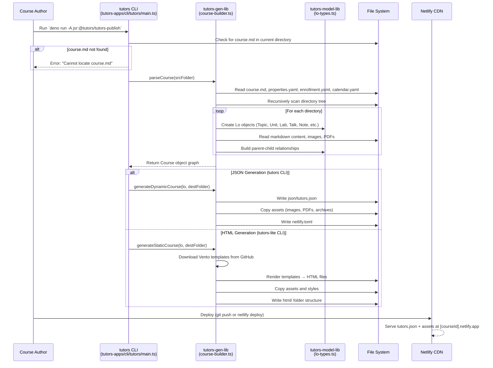

# Flow 01: Course Content Publishing

## Overview

Course authors create content as Markdown files in a structured directory hierarchy. The tutors CLI tools (in `tutors-apps` repo) parse this content and generate either JSON (for the Tutors Reader) or static HTML (for offline use), which is then deployed to Netlify.

## Trigger

- Course author runs `deno run -A jsr:@tutors/tutors-publish` (JSON) or `deno run -A jsr:@tutors/tutors-publish-html` (HTML) from the course directory.

## Repositories Involved

| Repository | Role |
|---|---|
| `tutors-apps` | CLI tools (`cli/tutors/main.ts`, `cli/tutors-lite/main.ts`), generator library, model library |

## Flow Diagram



## Input Directory Structure

```
course-folder/
├── course.md              # Course title, summary, content
├── properties.yaml        # Course properties (icon, private, etc.)
├── calendar.yaml          # Course calendar data
├── enrollment.yaml        # Enrolled student list
├── topic-01/
│   ├── topic.md           # Topic title and content
│   ├── unit-01/
│   │   ├── unit.md
│   │   ├── talk-01/
│   │   │   ├── talk.md
│   │   │   └── talk.pdf
│   │   ├── lab-01/
│   │   │   ├── lab.md
│   │   │   ├── 01.md      # Lab steps
│   │   │   └── 02.md
│   │   └── note-01/
│   │       └── note.md
│   └── side-01/
│       └── side.md
└── topic-02/
    └── ...
```

## Output (JSON Generator)

```
json/
├── tutors.json            # Complete course structure
├── [topic-assets]/        # Copied images, PDFs
└── netlify.toml           # Deployment config
```

## Key Files

| File | Repository | Purpose |
|---|---|---|
| `cli/tutors/main.ts` | tutors-apps | JSON generator entry point |
| `cli/tutors-lite/main.ts` | tutors-apps | HTML generator entry point |
| `cli/tutors-gen-lib/src/services/course-builder.ts` | tutors-apps | Parses course from filesystem |
| `cli/tutors-gen-lib/src/services/course-emitter.ts` | tutors-apps | Emits static HTML |
| `cli/tutors-model-lib/src/types/learning-objects.ts` | tutors-apps | Lo type definitions |

## External Calls

| Target | URL Pattern | Purpose |
|---|---|---|
| GitHub (templates) | `https://raw.githubusercontent.com/tutors-sdk/tutors-apps/refs/heads/development/cli/tutors-gen-lib/src/templates/vento/` | Download Vento templates for HTML generation |
