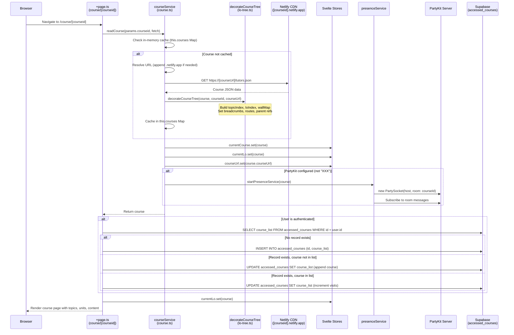

# Flow 02: Course Loading

## Overview

When a user navigates to a course page, the SvelteKit Reader fetches the course's `tutors.json` from Netlify, decorates the course tree with indices and routes, caches it in memory, and renders the course UI. If the user is authenticated, the course access is recorded in Supabase.

## Trigger

- User navigates to `/course/[courseid]` in the browser.

## URL Paths

| Component | Path |
|---|---|
| UI Page | `/course/[courseid]` |
| Netlify Course Data | `https://[courseid].netlify.app/tutors.json` |
| Supabase Table | `accessed_courses` |

## Repositories Involved

| Repository | Role |
|---|---|
| `tutors` | SvelteKit page, courseService, lo-tree decoration |

## Flow Diagram



## Course URL Resolution Logic

The `courseService.getOrLoadCourse()` resolves course IDs to URLs:

```
Input: "my-course"           → Fetches: https://my-course.netlify.app/tutors.json
Input: "my-course.netlify.app" → Fetches: https://my-course.netlify.app/tutors.json
Input: "custom-domain.com"   → Fetches: https://custom-domain.com/tutors.json
```

## Database Interactions

| Database | Table | Operation | Details |
|---|---|---|---|
| Supabase | `accessed_courses` | SELECT | Check if user has visited this course |
| Supabase | `accessed_courses` | INSERT | First visit - create record with course_list JSONB |
| Supabase | `accessed_courses` | UPDATE | Subsequent visits - update visits count and last_accessed |

## Key Files

| File | Path | Purpose |
|---|---|---|
| Page loader | `src/routes/(course-reader)/course/[courseid]/+page.ts` | SvelteKit load function |
| Course service | `src/lib/services/course.ts` | Fetch and cache course data |
| Tree decorator | `src/lib/services/models/lo-tree.ts` | Build indices and navigation |
| Page component | `src/routes/(course-reader)/course/[courseid]/+page.svelte` | Render course UI |
