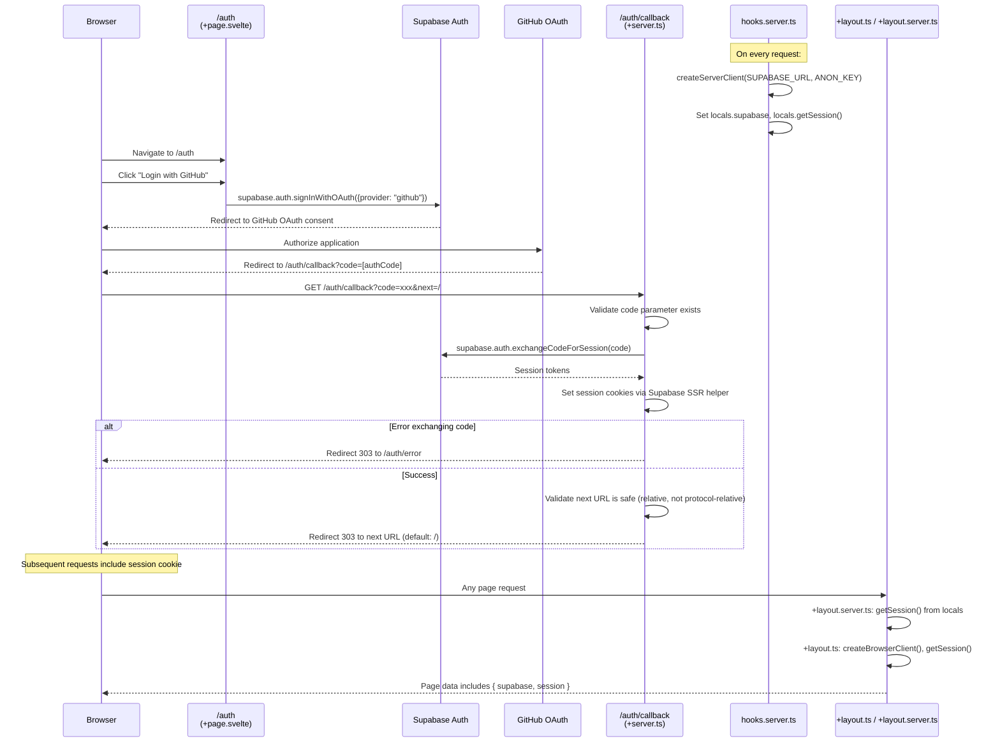

# Flow 03: Authentication (GitHub OAuth via Supabase)

## Overview

Authentication is handled via Supabase Auth with GitHub as the OAuth provider. The server-side hooks initialize a Supabase client on every request, and the auth callback endpoint exchanges the OAuth code for a session stored in cookies.

## Trigger

- User clicks "Login with GitHub" on the `/auth` page.

## URL Paths

| Component | Path |
|---|---|
| Login UI | `/auth` |
| OAuth Callback | `/auth/callback` |
| Post-login Redirect | `/` or `?next=` parameter |
| Dashboard (protected) | `/dashboard` |

## Repositories Involved

| Repository | Role |
|---|---|
| `tutors` | Auth pages, server hooks, Supabase client setup |

## Flow Diagram



## Session Data Structure

```typescript
session.user = {
  id: string,                              // Supabase user ID
  email: string,                           // GitHub email
  user_metadata: {
    full_name: string,                     // GitHub display name
    user_name: string,                     // GitHub username
    avatar_url: string,                    // GitHub avatar
    email: string,                         // GitHub email
    preferred_username: string             // GitHub username
  }
}
```

## Protected Routes

Routes that require authentication redirect to `/auth` if no session exists:

| Route | Protection |
|---|---|
| `/dashboard` | Redirects to `/auth` if `!session` |
| `/time/[courseid]` | Returns nothing if `!data.session` |
| `/next-time/[courseid]` | Returns nothing if `!data.session` |

## Security

- The `/auth/callback` server route validates the `next` redirect URL to prevent open redirect attacks:
  - Must start with `/`
  - Must not be protocol-relative (`//`)
- Supabase SSR helper manages httpOnly cookies for session storage
- `content-range` header is allowed through for Supabase API compatibility

## Key Files

| File | Path | Purpose |
|---|---|---|
| Server hooks | `src/hooks.server.ts` | Initialize Supabase client per request |
| Auth page | `src/routes/(auth)/auth/+page.svelte` | Login UI with GitHub button |
| Auth callback | `src/routes/(auth)/auth/callback/+server.ts` | OAuth code exchange |
| Layout server | `src/routes/+layout.server.ts` | Pass session to all pages |
| Layout client | `src/routes/+layout.ts` | Create browser Supabase client |
| Dashboard | `src/routes/(auth)/dashboard/+page.ts` | Protected page with redirect |

## Environment Variables

| Variable | Purpose |
|---|---|
| `PUBLIC_SUPABASE_URL` | Supabase project URL |
| `PUBLIC_SUPABASE_ANON_KEY` | Supabase anonymous API key |
