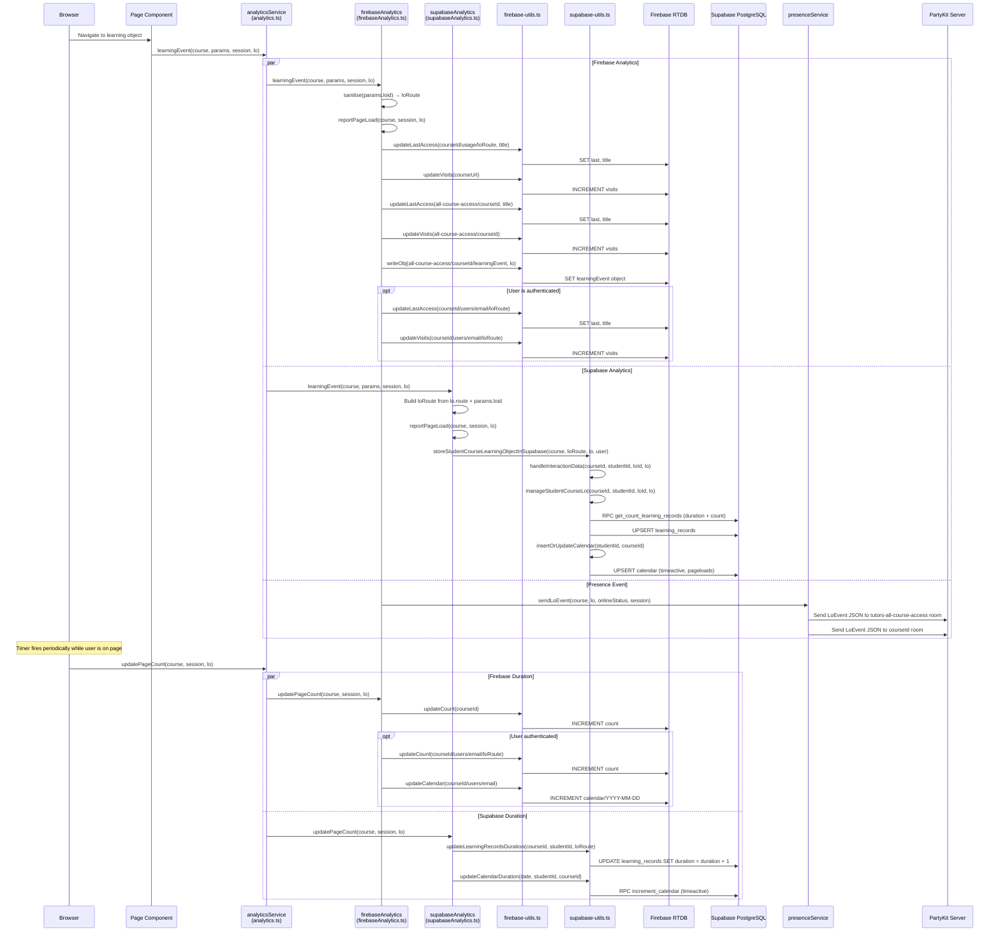
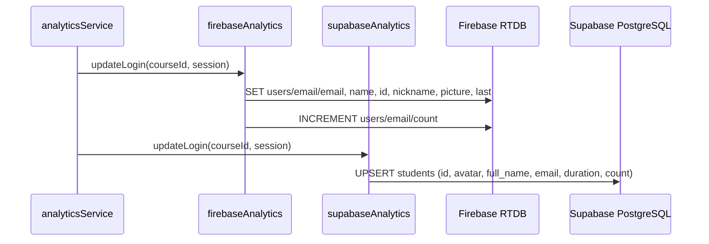

# Flow 04: Learning Event Tracking

## Overview

When an authenticated user views any learning object (topic, lab, note, talk, video), the analytics service dual-writes tracking data to both Firebase Realtime Database and Supabase PostgreSQL. This includes page load counts, visit timestamps, time-on-page duration, and calendar-based activity heatmaps.

## Trigger

- User navigates to any learning object page (topic, lab, note, talk, video, wall).
- Periodic timer fires to update page count / duration.

## URL Paths

| Component | Path |
|---|---|
| Course page | `/course/[courseid]` |
| Topic page | `/topic/[courseid]/[...loid]` |
| Lab page | `/lab/[courseid]/[...loid]` |
| Note page | `/note/[courseid]/[...loid]` |
| Talk page | `/talk/[courseid]/[...loid]` |
| Video page | `/video/[courseid]/[...loid]` |

## Repositories Involved

| Repository | Role |
|---|---|
| `tutors` | Analytics service, Firebase utils, Supabase utils |

## Flow Diagram

## Database Writes

### Firebase RTDB

| Path | Operation | When |
|---|---|---|
| `[courseId]/usage/[loRoute]/last` | SET timestamp | Every page load |
| `[courseId]/usage/[loRoute]/title` | SET title | Every page load |
| `[courseId]/usage/[loRoute]/visits` | INCREMENT | Every page load |
| `[courseId]/visits` | INCREMENT | Every page load |
| `[courseId]/users/[email]/[loRoute]/last` | SET timestamp | Auth'd page load |
| `[courseId]/users/[email]/[loRoute]/visits` | INCREMENT | Auth'd page load |
| `[courseId]/users/[email]/[loRoute]/count` | INCREMENT | Duration tick |
| `[courseId]/users/[email]/calendar/[date]` | INCREMENT | Duration tick |
| `[courseId]/count` | INCREMENT | Duration tick |
| `all-course-access/[courseId]/*` | SET/INCREMENT | Every page load |
| `all-course-access/[courseId]/learningEvent` | SET object | Every page load |

### Supabase PostgreSQL

| Table | Operation | When |
|---|---|---|
| `learning_records` | UPSERT (student_id, course_id, lo_id) | Every page load |
| `calendar` | UPSERT (id=date, studentid, courseid) | Every page load |
| `learning_records.duration` | UPDATE increment | Duration tick |
| `calendar.timeactive` | RPC increment_calendar | Duration tick |

## Login Tracking

## Key Files

| File | Path | Purpose |
|---|---|---|
| Analytics facade | `src/lib/services/analytics.ts` | Delegates to Firebase + Supabase |
| Firebase analytics | `src/lib/services/firebaseAnalytics.ts` | Firebase RTDB tracking |
| Supabase analytics | `src/lib/services/supabaseAnalytics.ts` | Supabase PostgreSQL tracking |
| Firebase utils | `src/lib/services/utils/firebase-utils.ts` | Firebase read/write operations |
| Supabase utils | `src/lib/services/utils/supabase-utils.ts` | Supabase read/write operations |
| Supabase client | `src/lib/services/utils/db/client.ts` | Supabase client initialization |
