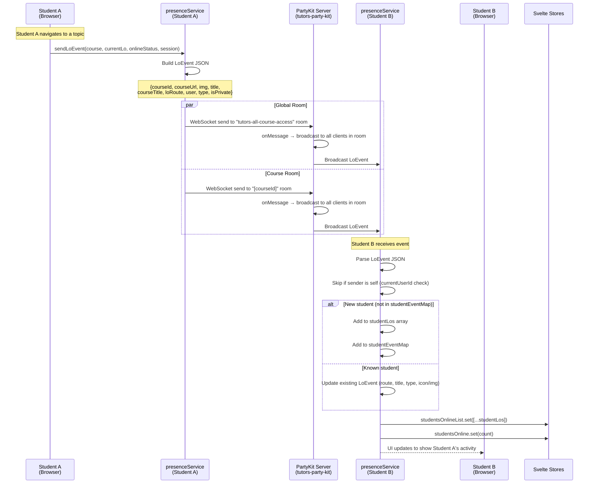

# Flow 05: Real-Time Presence

## Overview

The Tutors platform uses PartyKit WebSocket rooms to broadcast real-time student activity. When a user navigates within a course, a presence event is sent to both a course-specific room and a global room. Other connected clients receive these events and update their UI to show who is currently active.

## Trigger

- User views any learning object (as part of the analytics `reportPageLoad` call).
- Presence events are side-effects of learning event tracking (Flow 04).

## URL Paths

| Component | Path |
|---|---|
| Any course page | `/course/[courseid]`, `/topic/...`, `/lab/...`, etc. |
| Live dashboard | `/live` (consumer of global presence events) |

## Repositories Involved

| Repository | Role |
|---|---|
| `tutors` | presenceService (client-side WebSocket) |
| `tutors-apps` | PartyKit server (`party/tutors-party-kit/src/server.ts`) |

## Flow Diagram



## LoEvent Data Structure

```typescript
interface LoEvent {
  courseId: string;           // e.g., "my-course"
  courseUrl: string;          // e.g., "my-course.netlify.app"
  img?: string;              // Learning object image URL
  icon?: IconType;           // Learning object icon
  title: string;             // LO title
  courseTitle: string;        // Course title
  loRoute: string;           // Route path of current LO
  user: LoUser;              // Student info
  type: string;              // LO type (topic, lab, note, etc.)
  isPrivate: boolean;        // Course privacy flag
}

interface LoUser {
  fullName: string;          // "Anon" if not authenticated
  avatar: string;            // GitHub avatar or default logo
  id: string;                // GitHub username or generated UUID
}
```

## PartyKit Rooms

| Room ID | Purpose | Listeners |
|---|---|---|
| `tutors-all-course-access` | Global presence across all courses | `/live` page, global presence widget |
| `[courseId]` | Per-course presence | Course pages for that specific course |
| `tutors-simulator-[id]` | Simulator events | `/simulate` page |

## PartyKit Server Implementation

```typescript
// party/tutors-party-kit/src/server.ts
export default class TutorsPartyServer {
  onConnect(conn) {
    console.log(`Connected: ${conn.id}`);
  }
  onMessage(message, sender) {
    this.room.broadcast(message, [sender.id]); // Broadcast to all except sender
  }
}
```

## Key Files

| File | Path | Repository | Purpose |
|---|---|---|---|
| Presence service | `src/lib/services/presence.ts` | tutors | WebSocket client, event sending/receiving |
| PartyKit server | `party/tutors-party-kit/src/server.ts` | tutors-apps | WebSocket server, message broadcasting |
| Stores | `src/lib/stores.ts` | tutors | studentsOnline, coursesOnline stores |
| Environment | `src/lib/environment.ts` | tutors | PartyKit server URL config |

## Environment Variables

| Variable | Purpose | Example |
|---|---|---|
| `PUBLIC_party_kit_main_room` | PartyKit server URL | `https://tutors-party.edeleastar.partykit.dev` |

## Guard Condition

If `PUBLIC_party_kit_main_room === "XXX"`, the presence service is completely disabled. No WebSocket connections are made.
