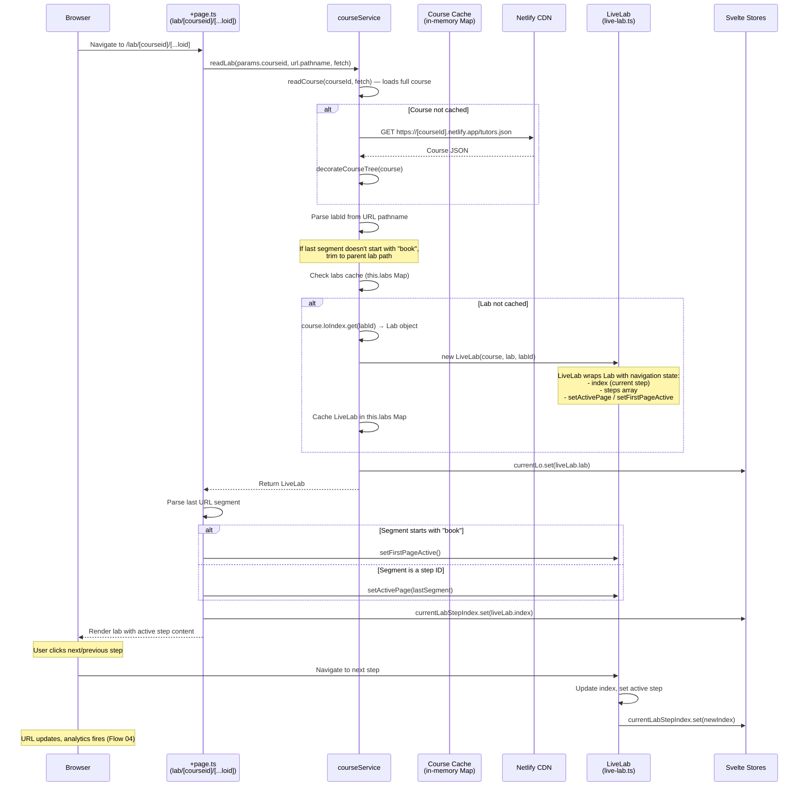

# Flow 06: Lab Navigation

## Overview

Labs are multi-step learning objects. When a user opens a lab, the system loads the lab's content with its ordered steps, sets the active page based on the URL, and allows step-by-step navigation. Each step change triggers analytics events.

## Trigger

- User navigates to `/lab/[courseid]/[...loid]` (e.g., `/lab/my-course/topic-01/unit-01/lab-01/book-01`).

## URL Paths

| Component | Path | Example |
|---|---|---|
| Lab page | `/lab/[courseid]/[...loid]` | `/lab/my-course/topic-01/unit-01/lab-01/book-01` |
| Lab step | `/lab/[courseid]/[...loid]/[step]` | `/lab/my-course/topic-01/unit-01/lab-01/01` |
| Course data | `https://[courseid].netlify.app/tutors.json` | Fetched if not cached |

## Repositories Involved

| Repository | Role |
|---|---|
| `tutors` | Lab page, LiveLab model, courseService |

## Flow Diagram



## Lab Data Model

```typescript
interface Lab extends Lo {
  type: "lab";
  los: LabStep[];            // Ordered steps (01.md, 02.md, etc.)
}

class LiveLab {
  course: Course;
  lab: Lab;
  index: number;             // Current step index
  
  setFirstPageActive(): void;
  setActivePage(step: string): void;
}
```

## URL Structure

```
/lab/my-course/topic-01/unit-01/lab-01/book-01     → First page (overview)
/lab/my-course/topic-01/unit-01/lab-01/01           → Step 1
/lab/my-course/topic-01/unit-01/lab-01/02           → Step 2
```

## Key Files

| File | Path | Purpose |
|---|---|---|
| Page loader | `src/routes/(course-reader)/lab/[courseid]/[...loid]/+page.ts` | Load lab, set active page |
| LiveLab model | `src/lib/services/models/live-lab.ts` | Lab navigation state management |
| Course service | `src/lib/services/course.ts:71-88` | readLab(), lab caching |
