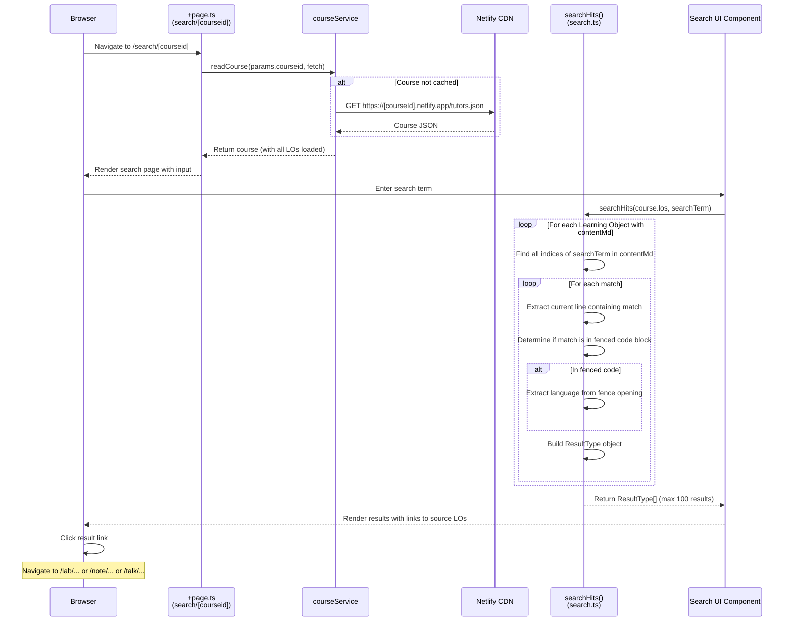

# Flow 07: Course Search

## Overview

The search feature performs client-side full-text search across all learning object content within a loaded course. It searches through the markdown content of all LOs, handles fenced code blocks specially, and returns matching lines with context about whether results are in code blocks and what language they're in.

## Trigger

- User navigates to `/search/[courseid]` and enters a search term.

## URL Paths

| Component | Path |
|---|---|
| Search page | `/search/[courseid]` |
| Course data | `https://[courseid].netlify.app/tutors.json` (if not cached) |

## Repositories Involved

| Repository | Role |
|---|---|
| `tutors` | Search page, search utility, courseService |

## Flow Diagram



## Search Result Type

```typescript
interface ResultType {
  fenced: boolean;           // Is the match inside a code fence?
  language: string;          // Code language (e.g., "typescript")
  contentMd: string;         // The line containing the match
  lab: Lo;                   // The LO containing the match
  html: string;              // Rendered HTML
  title: string;             // "parentTitle/loTitle"
  link: string;              // Route to the matching LO
}
```

## Key Characteristics

- **Client-side only**: No server or database calls for search; operates on the in-memory course tree
- **Max 100 results**: Truncated to prevent UI overload
- **Code-aware**: Distinguishes matches inside code fences (``` or ~~~) and identifies the language
- **Case-sensitive**: Uses JavaScript's `indexOf`, which is case-sensitive

## Key Files

| File | Path | Purpose |
|---|---|---|
| Page loader | `src/routes/(course-reader)/search/[courseid]/+page.ts` | Load course for searching |
| Search utility | `src/lib/services/utils/search.ts` | Full-text search with code fence detection |
| Page component | `src/routes/(course-reader)/search/[courseid]/+page.svelte` | Search UI |
