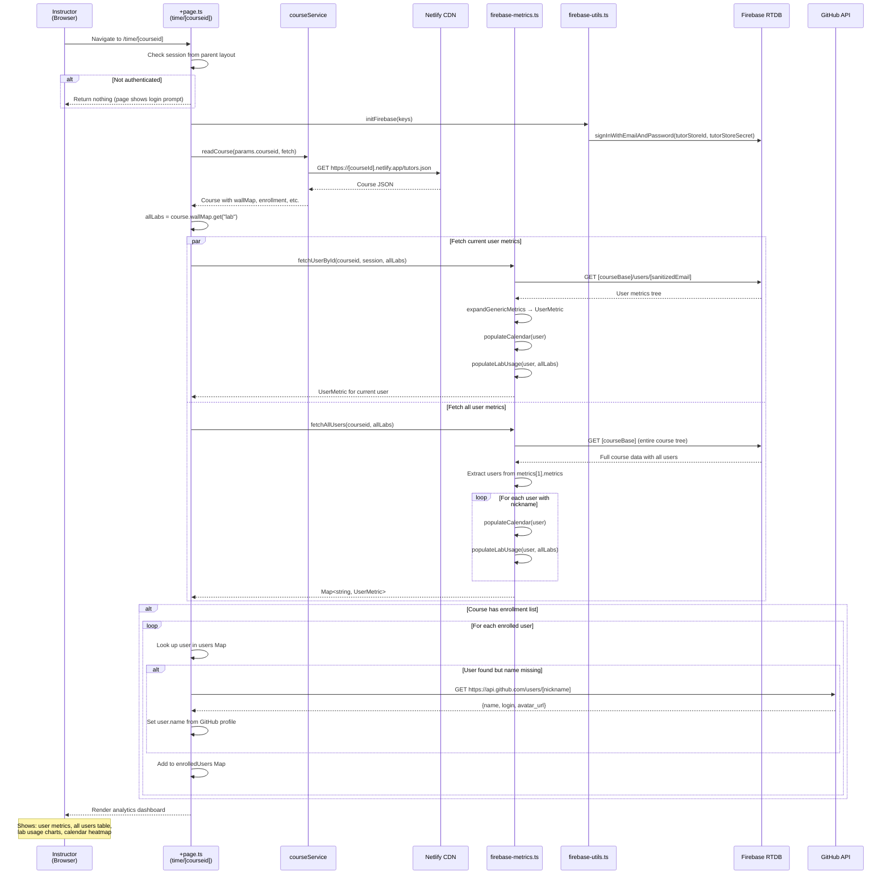

# Flow 08: Time Analytics (Firebase-Based)

## Overview

The Time Analytics page (`/time/[courseid]`) provides instructors with a view of student engagement metrics. It reads user activity data from Firebase Realtime Database, including per-user metrics, lab usage patterns, and calendar heatmaps. It also fetches GitHub profile data for enrolled users.

## Trigger

- Authenticated instructor navigates to `/time/[courseid]`.

## URL Paths

| Component | Path |
|---|---|
| Time Analytics page | `/time/[courseid]` |
| Course data | `https://[courseid].netlify.app/tutors.json` |
| GitHub API | `https://api.github.com/users/[username]` |

## Repositories Involved

| Repository | Role |
|---|---|
| `tutors` | Time page, Firebase metrics utilities |

## Flow Diagram



## Data Model

```typescript
interface UserMetric {
  userId: string;
  email: string;
  name: string;
  picture: string;
  nickname: string;
  onlineStatus: string;
  count: number;
  last: string;
  duration: number;
  metrics: Metric[];
  labActivity: Metric[];
  calendarActivity: DayMeasure[];
}

interface DayMeasure {
  date: string;              // "2024-03-15"
  dateObj: number;           // Date.parse() result
  metric: number;            // Activity count
}
```

## Firebase Data Read Paths

| Path | Purpose |
|---|---|
| `[courseBase]/users/[email]` | Individual user's metrics tree |
| `[courseBase]` | Entire course tree (to extract all users) |

## External API Calls

| Target | URL | Purpose |
|---|---|---|
| GitHub API | `GET https://api.github.com/users/[username]` | Fetch display name for enrolled users without name data |

## Key Files

| File | Path | Purpose |
|---|---|---|
| Page loader | `src/routes/(time)/time/[courseid]/+page.ts` | Load metrics from Firebase |
| Firebase metrics | `src/lib/services/utils/firebase-metrics.ts` | Parse Firebase user metrics |
| Firebase utils | `src/lib/services/utils/firebase-utils.ts` | Firebase RTDB operations |
| Environment | `src/lib/environment.ts` | Firebase config keys |

## Environment Variables

| Variable | Purpose |
|---|---|
| `PUBLIC_firebase_apiKey` | Firebase API key |
| `PUBLIC_firebase_projectId` | Firebase project ID |
| `PUBLIC_firebase_databaseUrl` | Firebase RTDB URL |
| `PUBLIC_tutors_store_id` | Firebase service account email |
| `PUBLIC_tutors_store_secret` | Firebase service account password |
