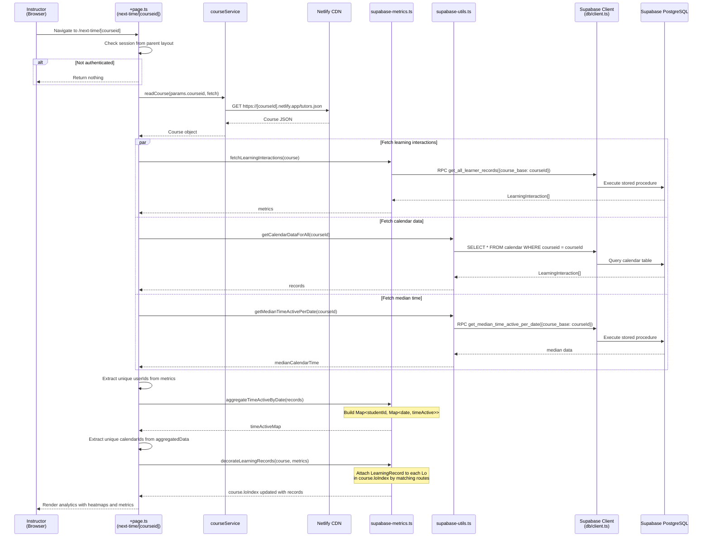
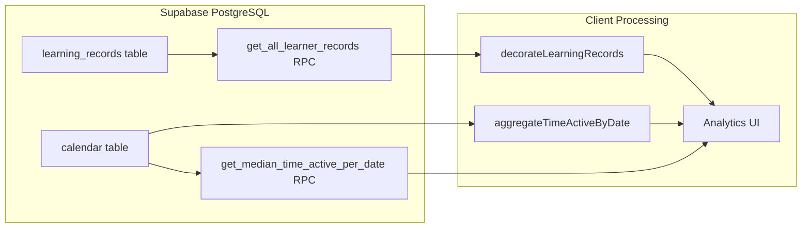
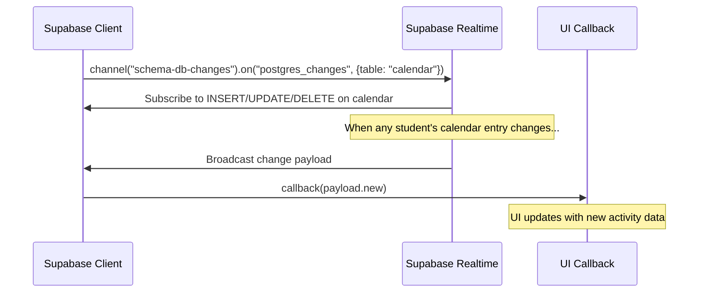

# Flow 09: Next-Time Analytics (Supabase-Based)

## Overview

The Next-Time Analytics page (`/next-time/[courseid]`) provides an alternative analytics view using Supabase as the data source. It fetches learning interactions, calendar data, and aggregates time-active metrics per student per date. This page uses Supabase RPC functions and real-time subscriptions.

## Trigger

- Authenticated instructor navigates to `/next-time/[courseid]`.

## URL Paths

| Component | Path |
|---|---|
| Next-Time page | `/next-time/[courseid]` |
| Course data | `https://[courseid].netlify.app/tutors.json` |

## Repositories Involved

| Repository | Role |
|---|---|
| `tutors` | Next-Time page, Supabase metrics utilities |

## Flow Diagram

## Supabase Queries

| Query Type | Target | Parameters | Purpose |
|---|---|---|---|
| RPC | `get_all_learner_records` | `course_base` | All learning records for course |
| SELECT | `calendar` | `WHERE courseid = courseId` | All calendar entries for course |
| RPC | `get_median_time_active_per_date` | `course_base` | Median active time across all dates |

## Data Flow

## Real-Time Subscription

The system also sets up a Supabase real-time subscription for live calendar updates:

## Key Files

| File | Path | Purpose |
|---|---|---|
| Page loader | `src/routes/(time)/next-time/[courseid]/+page.ts` | Orchestrate data fetching |
| Supabase metrics | `src/lib/services/utils/supabase-metrics.ts` | Fetch/aggregate learning records |
| Supabase utils | `src/lib/services/utils/supabase-utils.ts` | Calendar queries, real-time sub |
| DB client | `src/lib/services/utils/db/client.ts` | Supabase client instance |
