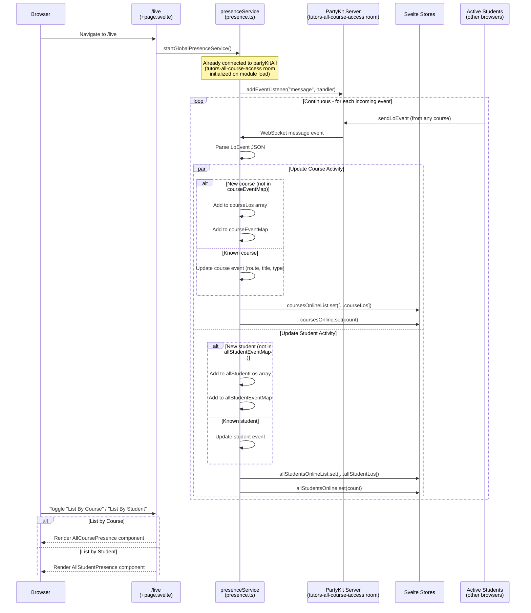
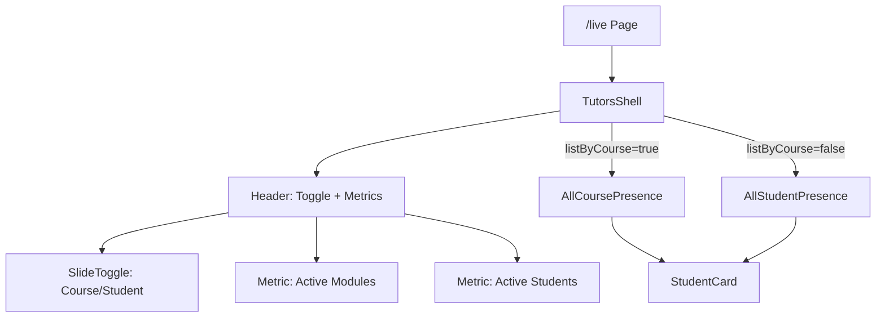

# Flow 10: Live Dashboard

## Overview

The Live Dashboard (`/live`) shows real-time student activity across all courses. It connects to the PartyKit global room and displays incoming presence events, showing which students are viewing which courses and learning objects. Users can toggle between "list by course" and "list by student" views.

## Trigger

- User navigates to `/live`.

## URL Paths

| Component | Path |
|---|---|
| Live page | `/live` |

## Repositories Involved

| Repository | Role |
|---|---|
| `tutors` | Live page, presenceService global listener |
| `tutors-apps` | PartyKit server (message broadcasting) |

## Flow Diagram

## UI Components

## Store Bindings

| Store | Type | Updated By |
|---|---|---|
| `coursesOnline` | `number` | presenceService (course count) |
| `coursesOnlineList` | `LoEvent[]` | presenceService (course events) |
| `allStudentsOnline` | `number` | presenceService (student count) |
| `allStudentsOnlineList` | `LoEvent[]` | presenceService (student events) |

## Key Files

| File | Path | Purpose |
|---|---|---|
| Live page | `src/routes/(time)/live/+page.svelte` | Live dashboard UI |
| Presence service | `src/lib/services/presence.ts:83-115` | startGlobalPresenceService() |
| AllCoursePresence | `src/lib/ui/time/AllCoursePresence.svelte` | Course activity view |
| AllStudentPresence | `src/lib/ui/time/AllStudentPresence.svelte` | Student activity view |
| StudentCard | `src/lib/ui/time/StudentCard.svelte` | Individual activity card |
