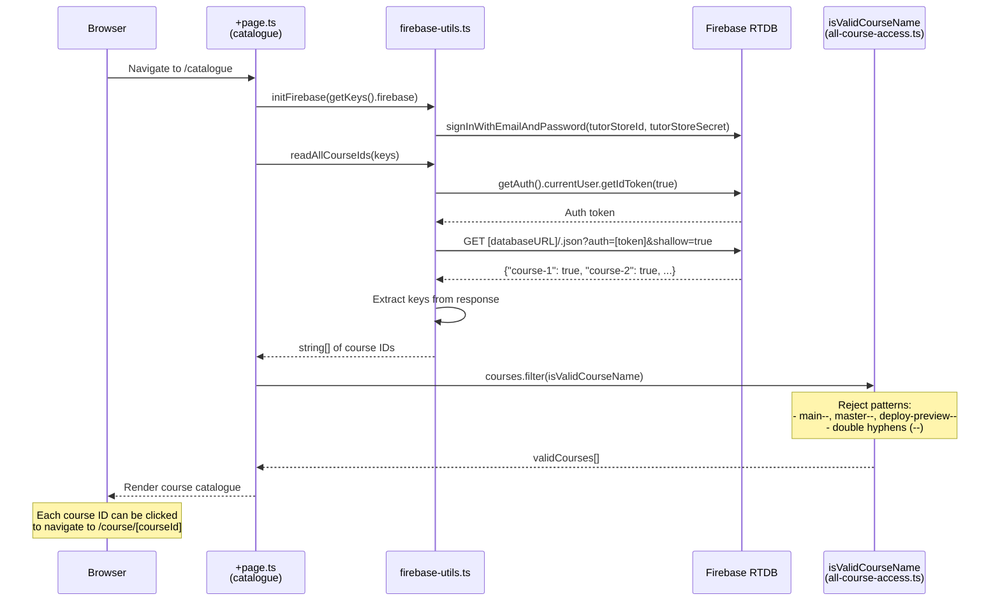

# Flow 11: Course Catalogue

## Overview

The Course Catalogue page (`/catalogue`) lists all courses available on the platform by reading course IDs from Firebase Realtime Database. It authenticates with Firebase using service credentials, reads the shallow course list, and filters out invalid course names (e.g., deployment preview branches).

## Trigger

- User navigates to `/catalogue`.

## URL Paths

| Component | Path |
|---|---|
| Catalogue page | `/catalogue` |

## Repositories Involved

| Repository | Role |
|---|---|
| `tutors` | Catalogue page, Firebase utils for reading course IDs |

## Flow Diagram



## Filtering Logic

```typescript
function isValidCourseName(course: string) {
  const invalidPatterns = /^(main--|master--|deploy-preview--)|-{2}/;
  return !invalidPatterns.test(course);
}
```

This filters out:
- Netlify deployment preview branches (`deploy-preview--123`)
- Main/master branch deployments (`main--`, `master--`)
- Any course ID containing double hyphens

## Firebase Queries

| Operation | URL/Path | Purpose |
|---|---|---|
| Auth | `signInWithEmailAndPassword` | Authenticate service account |
| GET | `[databaseURL]/.json?auth=[token]&shallow=true` | List all top-level keys (course IDs) |

## Key Files

| File | Path | Purpose |
|---|---|---|
| Page loader | `src/routes/(time)/catalogue/+page.ts` | Load course IDs from Firebase |
| Firebase utils | `src/lib/services/utils/firebase-utils.ts:163-176` | readAllCourseIds() |
| Course filter | `src/lib/services/utils/all-course-access.ts:19-22` | isValidCourseName() |
