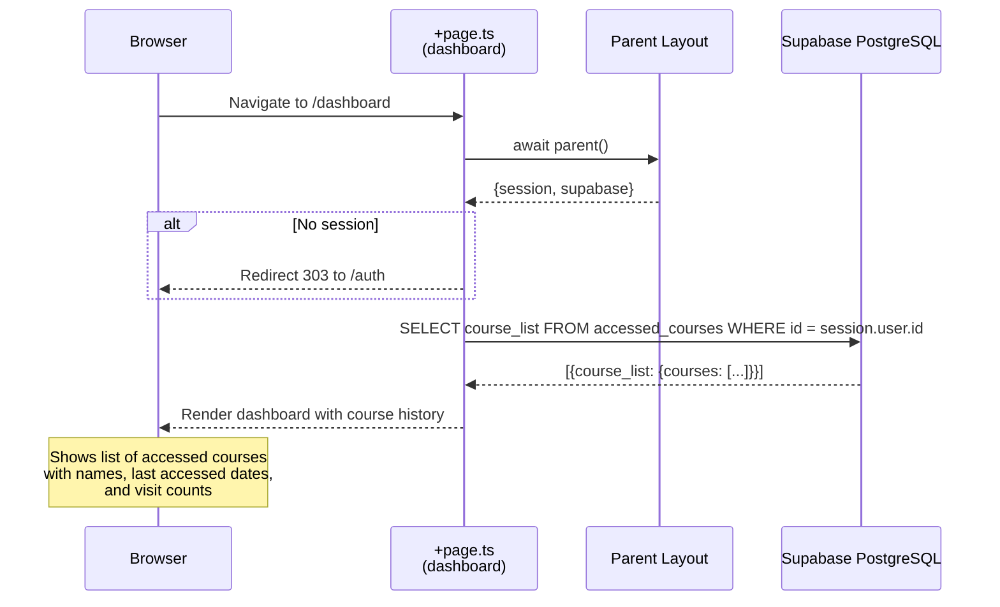

# Flow 12: User Dashboard

## Overview

The User Dashboard (`/dashboard`) shows an authenticated user's course access history. It reads the `accessed_courses` table from Supabase, which stores a JSONB list of courses the user has visited along with visit counts and timestamps. If the user is not authenticated, they are redirected to `/auth`.

## Trigger

- Authenticated user navigates to `/dashboard`.

## URL Paths

| Component | Path |
|---|---|
| Dashboard page | `/dashboard` |
| Auth redirect | `/auth` (if not authenticated) |

## Repositories Involved

| Repository | Role |
|---|---|
| `tutors` | Dashboard page, Supabase query |

## Flow Diagram



## Database Schema

### `accessed_courses` Table

| Column | Type | Purpose |
|---|---|---|
| `id` | UUID | Supabase user ID (from session.user.id) |
| `course_list` | JSONB | Course access history |

### `course_list` JSONB Structure

```json
{
  "courses": [
    {
      "id": "my-course.netlify.app",
      "name": "My Course Title",
      "last_accessed": "2024-03-15T10:30:00.000Z",
      "visits": 5
    }
  ]
}
```

## Data Population

The `accessed_courses` table is populated by the Course Loading flow (Flow 02). When an authenticated user visits `/course/[courseid]`, the page loader inserts or updates the user's course list.

## Key Files

| File | Path | Purpose |
|---|---|---|
| Page loader | `src/routes/(auth)/dashboard/+page.ts` | Auth check + Supabase query |
| Page component | `src/routes/(auth)/dashboard/+page.svelte` | Dashboard UI |
| Layout | `src/routes/(auth)/dashboard/+layout.svelte` | Dashboard layout wrapper |
