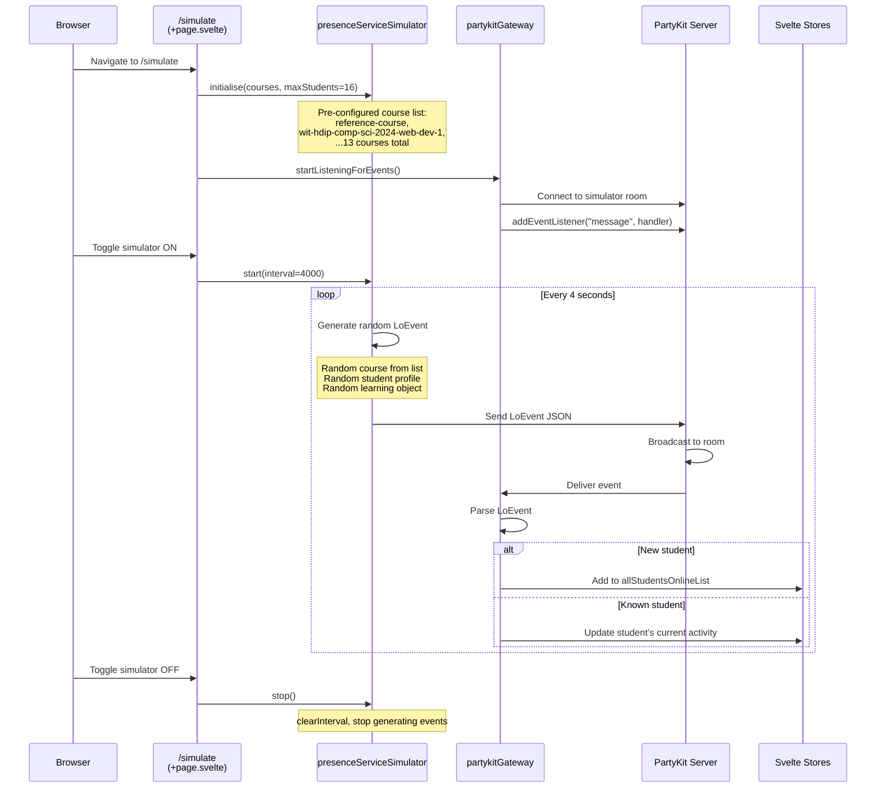

# Flow 13: Simulator

## Overview

The Simulator (`/simulate`) generates fake student presence events and sends them to PartyKit, simulating real student activity for testing and demonstration purposes. It creates random student profiles and sends periodic LoEvent messages through a dedicated PartyKit room.

## Trigger

- User navigates to `/simulate` and toggles the simulator on.

## URL Paths

| Component | Path |
|---|---|
| Simulator page | `/simulate` |

## Repositories Involved

| Repository | Role |
|---|---|
| `tutors` | Simulator page, presence simulator service, PartyKit gateway |
| `tutors-apps` | PartyKit server (message broadcasting) |

## Flow Diagram



## Simulated Courses

The simulator uses a hardcoded list of real courses:

```
reference-course
wit-hdip-comp-sci-2024-web-dev-1
wit-hdip-comp-sci-2024-programming
wit-hdip-comp-sci-databases-2023
setu-hdip-comp-sci-2024-comp-sys
full-stack-1-2023
wit-hdip-comp-sci-2022-mobile-app-dev
adv-full-stack-oth-2023.netlify.app
fsf21.netlify.app
web-design-for-ecommerce
classic-design-patterns
iot-protocols-2022
netfor
```

## Key Files

| File | Path | Purpose |
|---|---|---|
| Simulator page | `src/routes/(time)/simulate/+page.svelte` | Toggle UI, course list |
| Presence simulator | `src/routes/(time)/simulate/presence-simulator.ts` | Generate fake LoEvents |
| PartyKit gateway | `src/routes/(time)/simulate/partykit-gateway.ts` | WebSocket listener for sim room |
