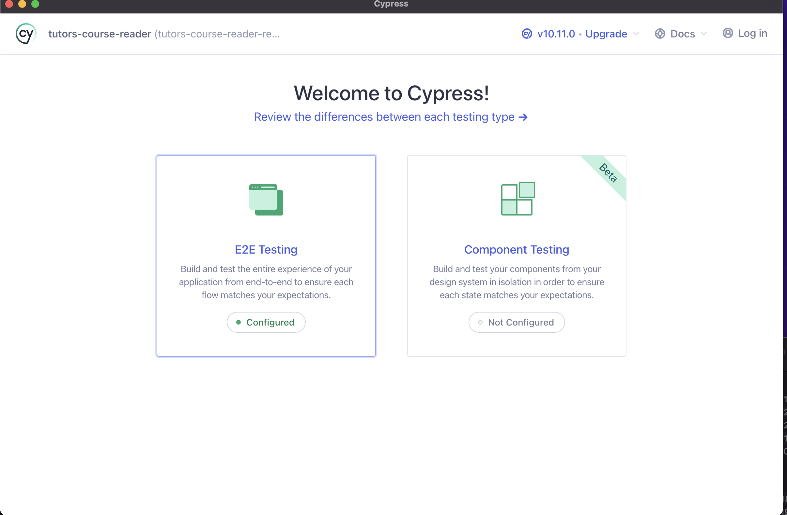
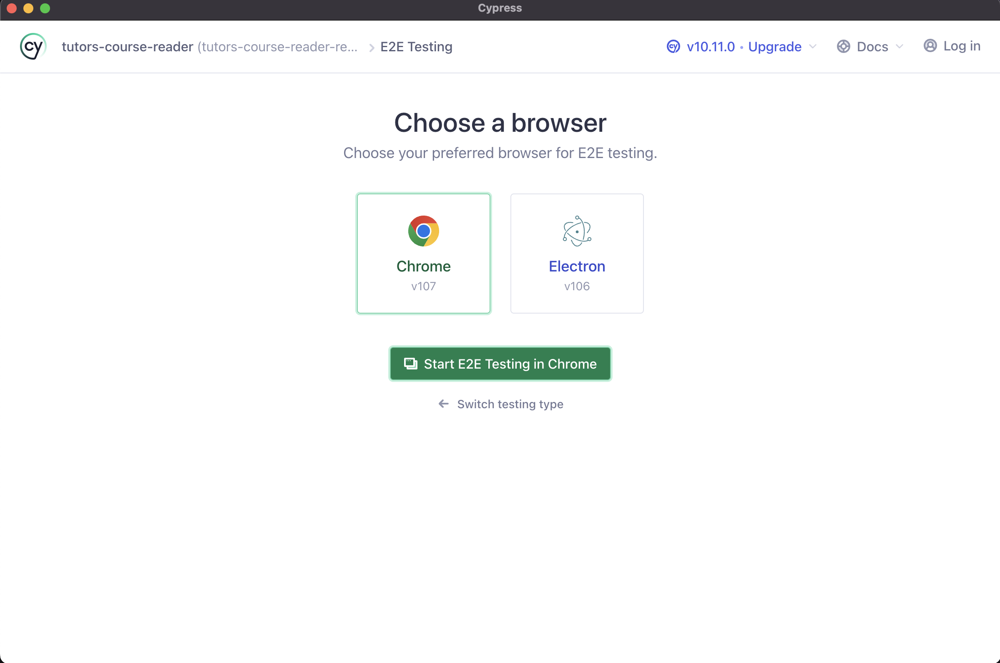

# tutors-next

A next generation reader for the [tutors-json](https://github.com/tutors-sdk/tutors-json) static site generator.

Part of the [Tutors SDK](https://github.com/tutors-sdk) project, tutors-next is a [Svelte](https://svelte.dev/) & [TypeScript](https://www.typescriptlang.org/) application, which consumes JSON output from [tutors-json](https://github.com/tutors-sdk/tutors-json), rendering an interactive experience. The application identifies the published course from a URL, recovers the JSON version of the static site and then renders a Svelte application.

The reader is intended for educational content, some representative examples:

- <https://wit-hdip-comp-sci.github.io>
- <https://oth-mobile-app-dev-2019.netlify.app>
- <https://wit-msc-agile-2019.netlify.app>
- <https://classic-design-patterns.netlify.app>
- <https://wit-hdip-comp-sci-2019.netlify.app>

## E2E Testing
End-to-End testing of the web application is handled using [Cypress](https://docs.cypress.io/guides/overview/why-cypress). Cypress is an open-source free Javascript testing tool. 
<br>
To run the test suite, you must be in the sites/tutors-course-reader directory

```bash
cd sites/tutors-course-reader
```

Install node dependancies <br>
See [Getting Started](../../README.md) section in the root README.md 

Now you can start the reader

```bash
npm run dev
```
In a separate terminal start the Cypress runner

```bash
npx cypress open
```
The Cypress runner should start and appear on your machine, select the `E2E Testing` option <br>
 <br>

Next, select your preffered browser option followed by the start button below <br>
 <br>

You can now select the tests you want to execute from the `Specs` tab  

Documentation for the Tutors SDK can be found at the [Tutors Docs](http://tutors-docs.netlify.app/) website.

## License

The Tutors SDK is open-source software licensed under the [MIT License](https://github.com/tutors-sdk/tutors-next/blob/development/LICENSE.md).
